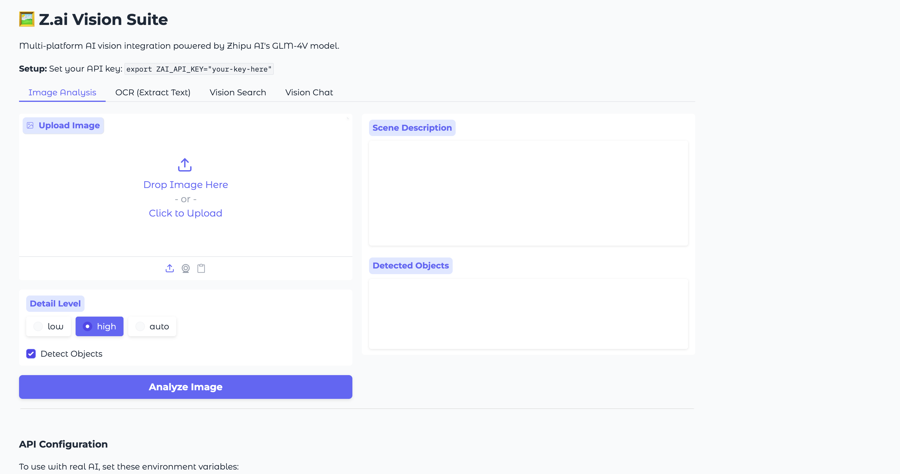
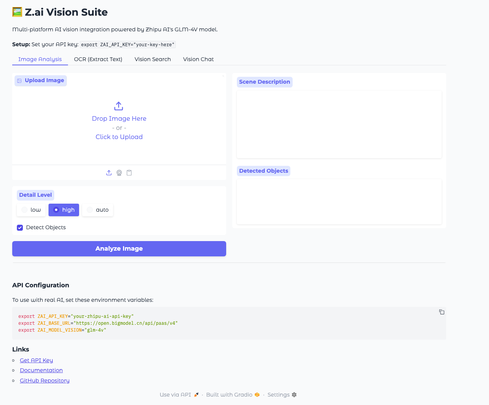
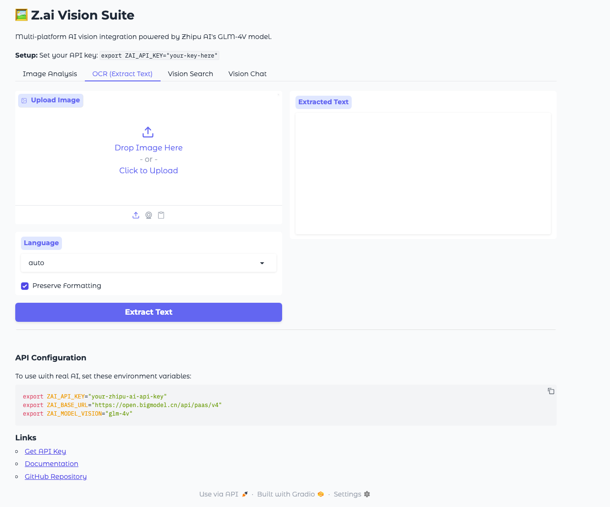
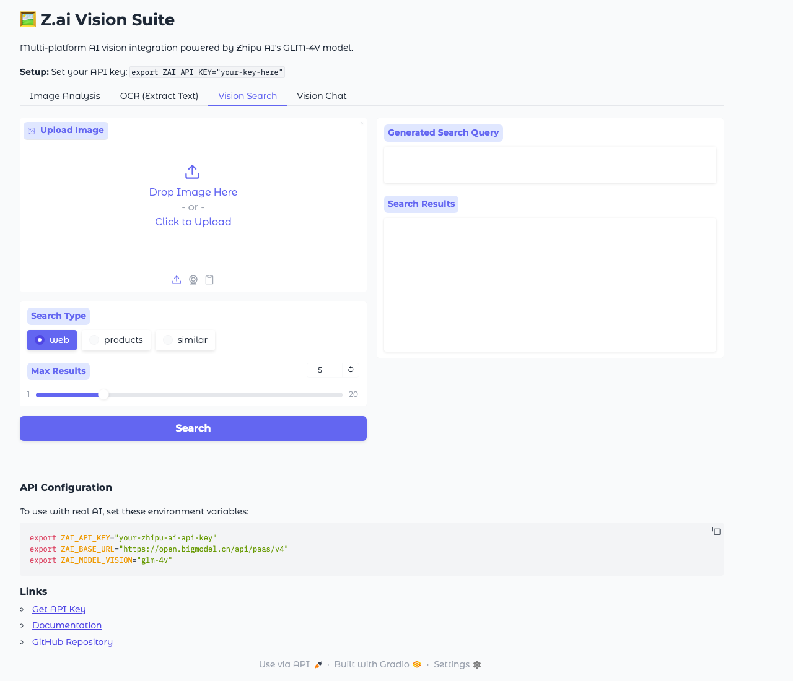
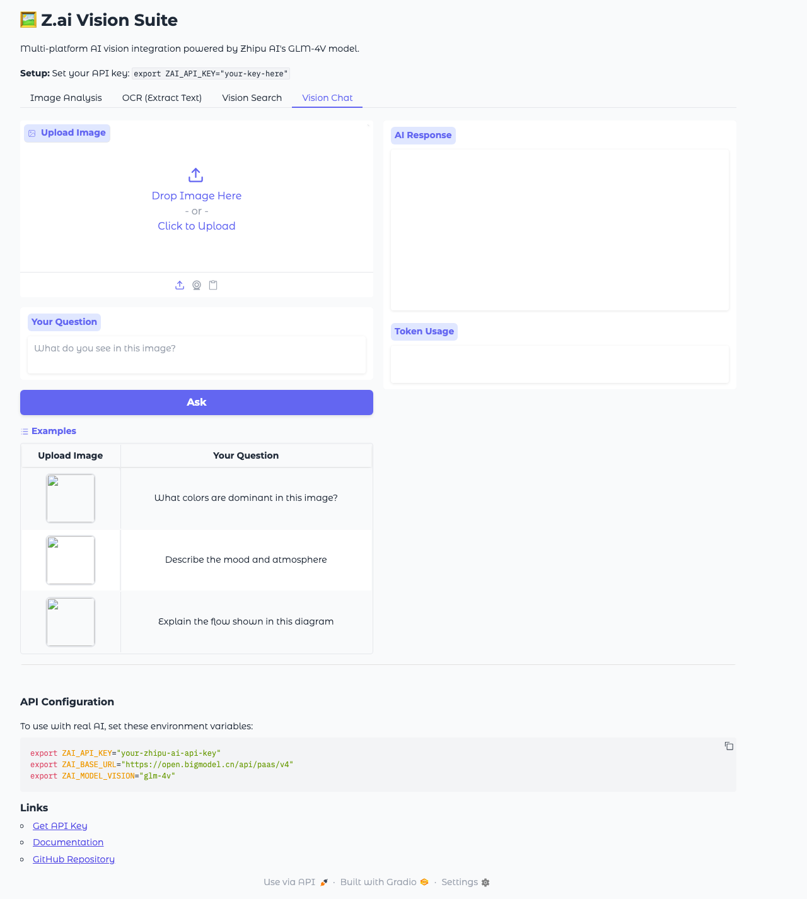

<div align="center">

# 📸 Z.ai Vision Suite

**AI-Powered Visual Intelligence Suite for Node.js & TypeScript**

[](https://www.npmjs.com/package/zai-vision-suite)
[](https://opensource.org/licenses/MIT)
[](https://www.typescriptlang.org/)

*Advanced computer vision capabilities powered by Zhipu AI's GLM-4V multimodal model*

---

**Features** • **Installation** • **Quick Start** • **API Reference** • **CLI Usage** • **Web App** • **Examples**

</div>

---

## ✨ Features

| Feature | Description |
|---------|-------------|
| 🔍 **Image Analysis** | Detailed scene understanding, object detection, and visual context analysis |
| 📝 **OCR Text Extraction** | Extract text from images with multi-language support |
| 🎥 **Video Processing** | Analyze video frames and generate scene summaries |
| 🔎 **Vision Search** | Search the web using images as queries |
| 💬 **Vision Chat** | Interactive conversational AI for image Q&A |
| 🌐 **Web Search Enhanced** | AI-powered query generation from visual content |
| 🔧 **CLI Tools** | Ready-to-use command-line utilities |
| 🎨 **Web Interface** | Beautiful Gradio & Streamlit web apps |

---

## 📸 Screenshots

### Homepage



### Image Analysis Tab



### OCR Tab



### Vision Search Tab



### Vision Chat Tab



---

## 📦 Installation

```bash
# Install the package
npm install zai-vision-suite

# Or install globally for CLI usage
npm install -g zai-vision-suite
```

### Prerequisites

- Node.js 18+ or TypeScript 5.0+
- Zhipu AI API key from [https://open.bigmodel.cn/](https://open.bigmodel.cn/)

---

## 🚀 Quick Start

### 1. Set up your API key

```bash
export ZAI_API_KEY="your-zhipu-ai-api-key"
```

### 2. Basic usage

```typescript
import { ZaiVisionClient } from 'zai-vision-suite';

const client = new ZaiVisionClient();

// Analyze an image
const analysis = await client.analyze('photo.jpg');
console.log(analysis.scene);
console.log(analysis.objects);

// Extract text
const ocr = await client.extractText('document.png');
console.log(ocr.text);
```

---

## 📚 API Reference

### ZaiVisionClient

Main client class for all vision operations.

#### Constructor

```typescript
new ZaiVisionClient(apiKey?: string, baseUrl?: string)
```

#### Methods

##### `analyze(imagePath, options)`

Analyze an image with detailed scene understanding.

```typescript
const result = await client.analyze('image.jpg', {
  detail: 'high' | 'low' | 'auto'
});

// Returns: { scene: string, objects: Array<{label, confidence}> }
```

##### `extractText(imagePath, options)`

Extract text from images using OCR.

```typescript
const result = await client.extractText('document.jpg', {
  language: 'auto' | 'en' | 'zh' | 'es' | 'fr' | 'de',
  preserveFormatting: true
});

// Returns: { text: string, language?: string, confidence?: number }
```

##### `visionSearch(imagePath, options)`

Search the web using an image as query.

```typescript
const result = await client.visionSearch('product.jpg', {
  searchType: 'web' | 'products' | 'similar',
  maxResults: 10
});

// Returns: { query: string, results: Array<{title, url, description, similarity}> }
```

##### `visionChat(imagePath, prompt, options)`

Interactive conversational AI for image Q&A.

```typescript
const result = await client.visionChat('photo.jpg', 'What colors are dominant?', {
  temperature: 0.7
});

// Returns: { response: string, usage?: {...} }
```

---

## 💻 CLI Usage

The package includes 6 command-line tools:

### analyze-image

```bash
analyze-image photo.jpg --detail high
```

### extract-text

```bash
extract-text document.png --language auto
```

### process-video

```bash
process-video video.mp4 --frames 10 --summarize
```

### vision-search

```bash
vision-search product.jpg --type products --max 15
```

### vision-web-search

```bash
vision-web-search photo.jpg --query-type information
```

### vision-chat

```bash
vision-chat photo.jpg "Describe the mood of this image"
```

---

## 🌐 Web Application

A beautiful web interface is included for interactive use.

### Running with Gradio

```bash
cd webapp
pip install -r requirements.txt
python app.py
```

### Running with Streamlit

```bash
cd webapp
pip install -r requirements.txt
streamlit run app_streamlit.py
```

The web app includes:
- **Image Analysis Tab**: Upload images for detailed visual analysis
- **OCR Tab**: Extract text from images with live preview
- **Vision Search Tab**: Search the web using images
- **Vision Chat Tab**: Ask questions about images in natural language

---

## 🧪 Testing

```bash
# Run all tests
npm test

# Run with coverage
npm run test:coverage

# Run tests in watch mode
npm run test:watch
```

---

## 🔧 Configuration

### Environment Variables

| Variable | Description | Default |
|----------|-------------|---------|
| `ZAI_API_KEY` | Your Zhipu AI API key | *required* |
| `ZAI_BASE_URL` | API base URL | `https://open.bigmodel.cn/api/paas/v4` |
| `ZAI_MODEL_VISION` | Model name | `glm-4v` |
| `ZAI_MAX_RETRIES` | Max retry attempts | `3` |
| `ZAI_TIMEOUT_MS` | Request timeout | `60000` |
| `ZAI_DEBUG` | Enable debug logging | `false` |

---

## 📖 Examples

### Example 1: Batch Image Analysis

```typescript
import { ZaiVisionClient } from 'zai-vision-suite';
import { readdir } from 'fs/promises';

const client = new ZaiVisionClient();
const files = await readdir('images');

for (const file of files) {
  if (file.match(/\.(jpg|png|webp)$/)) {
    const result = await client.analyze(`images/${file}`);
    console.log(`${file}: ${result.scene}`);
  }
}
```

### Example 2: OCR with Translation

```typescript
import { ZaiVisionClient } from 'zai-vision-suite';

const client = new ZaiVisionClient();

// Extract Chinese text
const { text } = await client.extractText('chinese-document.png', {
  language: 'zh'
});

console.log('Extracted:', text);
```

### Example 3: Product Search

```typescript
import { ZaiVisionClient } from 'zai-vision-suite';

const client = new ZaiVisionClient();

const { query, results } = await client.visionSearch('furniture.jpg', {
  searchType: 'products',
  maxResults: 5
});

console.log('Search Query:', query);
results.forEach(r => {
  console.log(`- ${r.title}: ${r.url}`);
});
```

---

## 🎯 Use Cases

- **E-commerce**: Product search from photos, price comparison
- **Document Processing**: Invoice scanning, form digitization
- **Content Moderation**: Image classification and safety checking
- **Accessibility**: Alt text generation, image descriptions
- **Research**: Data extraction from charts and graphs
- **Security**: Logo detection, brand monitoring
- **Education**: Handwriting recognition, formula extraction

---

## 🤝 Contributing

Contributions are welcome! Please see [CONTRIBUTING.md](CONTRIBUTING.md) for guidelines.

---

## 📄 License

MIT © [Ripnrip](https://github.com/Ripnrip)

---

## 🔗 Links

- [GitHub Repository](https://github.com/Ripnrip/zai-vision-suite)
- [Zhipu AI Documentation](https://open.bigmodel.cn/dev/api)
- [NPM Package](https://www.npmjs.com/package/zai-vision-suite)
- [Issue Tracker](https://github.com/Ripnrip/zai-vision-suite/issues)

---

<div align="center">

**Built with ❤️ using TypeScript & Zhipu AI GLM-4V**

</div>
